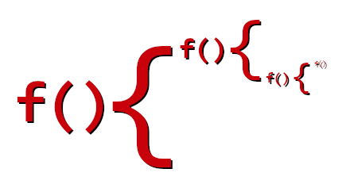

# fabricate

> n. To create quickly and easily.

<p align="center">
  
</p>

A tiny vanilla JS webapp framework with a fluent API and zero dependencies,
intended for small apps with relatively simply layouts. Includes with some
pre-prepared components to get started quickly.

- [Introduction](#introduction)
- [Installation](#installation)
- [API](#api)
- [Built-in components](#built-in-components)
- [Run tests](#run-tests)

See `examples` for some simple example apps.


## Introduction

The aim of `fabricate.js` is to allow a quick and expressive way to set up UI
with a fluent API based on method chaining. This allows creating elements with
styles, attributes, handlers, and child elements in an easy and predictable
fashion.

For example, a text element in a padded container:

```js
const Label = ({ text }) => fabricate('span')
  .setStyles({ fontSize: '1.1rem' })
  .setText(text);

// Column is one of many included basic components
const Container = () => fabricate('Column').setStyles({ padding: '10px' });

const App = () => Container()
  .setChildren([
    Label({ text: 'Hello, world!' }),
    Label({ text: 'Welcome to fabricate.js!' }),
  ]);

// Use as the root app element
fabricate.app(App());
```

Components created with `fabricate.js` can be extended after they are created,
for example this button with a hover-based highlight effect:

```js
const BasicButton = () => fabricate('div')
  .setStyles({
    padding: '8px 10px',
    color: 'white',
    backgroundColor: 'gray',
    borderRadius: '5px',
    justifyContent: 'center',
    cursor: 'pointer',
  })
  .setText('Click me!')
  .onClick(onButtonClicked)
  .onHover({
    start: el => el.addStyles({ filter: 'brightness(1.1)' }),
    end: el => el.addStyles({ filter: 'brightness(1)' }),
  });
```

This component can then be specialised for other uses:

```js
const SubmitButton = () => BasicButton()
  .setStyles({ backgroundColor: 'green' })
  .setText('Submit')
  .onClick(() => alert('Success!'));

const CancelButton = () => BasicButton()
  .setStyles({ backgroundColor: 'red' })
  .setText('Cancel')
  .onClick(() => alert('Cancelled!'));
```

See the `examples` directory for more examples, including simple apps.

Some basic components are included to quickly build a UI, see below for more
details.


## Installation

Install from a CDN, such as `unpkg`:

```html
<!-- Where x.y.z is a published version -->
<script src="https://unpkg.com/fabricate.js@x.y.z/fabricate.js"></script>
```

or install from [npm](https://www.npmjs.com/package/fabricate.js) and copy or
reference `fabricate.js` from `node_modules`:

```html
<script type="text/javascript" src="./node_modules/fabricate.js/fabricate.js"></script>
```


### Types

TypeScript users can import types from the `types/fabricate.d.ts` file:

```js
import { Fabricate } from '../node_modules/fabricate.js/types/fabricate';
```


## API

The API is split into two sections - component construction and app helpers.

### Component construction

* [Create `Component`](#component)
  * [`.asFlex()`](#asflex)
  * [`.setStyles()` / `setAttributes()`](#setstyles--setattributes)
  * [`.setChildren()` / `addChildren`](#setchildren--addchildren)
  * [`.onClick()` / `onHover()` / `onChange()`](#onclick--onhover--onchange)
  * [`.onCreate()` / `.onDestroy()`](#oncreate--ondestroy)
  * [`.onEvent()`](#onevent)
  * [`.displayWhen()`](#displaywhen)
  * [`.empty()`](#empty)

### App helpers

* [`fabricate` / `fab` helpers](#fabricate--fab)
  * [`.isNarrow()`](#isnarrow)
  * [`.app()`](#app)
  * [`.declare()`](#declare)
  * [`.onKeyDown()`](#onkeydown)
  * [`.update()` / `.onUpdate()`](#update--onupdate)
  * [`.clearState()`](#clearstate)
  * [`.buildKey()`](#buildkey)


### `Component`

To create a `Component`, simply specify the tag or declared component name:

```js
const EmptyDivComponent = () => fabricate('div');
```

> The shorter convenience alias `fab` is also available.

#### `.asFlex()`

To quickly set basic `display: flex` and `flexDirection` styles:

```js
const Column = () => fabricate('div').asFlex('column');
const Row = () => fabricate('div').asFlex('row');
```

> The `Row` and `Column` basic components are included for this purpose.

#### `.setStyles()` / `setAttributes()`

Set element styles and tag attributes:

```js
const BannerImage = ({ src }) => fabricate('img')
  .setStyles({ width: '800px', height: 'auto' })
  .setAttributes({ src });
```

#### `.setChildren()` / `.addChildren()`

Set other components as children to a parent, replacing any existing ones:

```js
const ButtonRow = () => fabricate('Row')
  .setChildren([
    fabricate('Button', { text: 'Submit'}),
    fabricate('Button', { text: 'Cancel'}),
  ]);
```

Later, add more children to the existing list:

```js
ButtonRow.addChildren([
  fabricate('Button', { text: 'Later'}),
]);
```

#### `.onClick()` / `onHover()` / `.onChange()`

Add click and hover behaviors, which are provided the same element to allow
updating styles and attributes etc:

> All component callbacks and handlers have the same signature:
> `cb(element, state, ...others)`

```js
fabricate('Button', { text: 'Click me!' })
  .onClick(el => alert('Clicked!'))
  .onHover({
    start: el => console.log('may be clicked'),
    end: el => console.log('maybe not'),
  });
```

Hovering can also be implemented with just a callback if preferred:

```js
fabricate('Button', { text: 'Click me!' })
  .onClick((el, state) => {
    alert(`Clicked ${state.counter} times!`);
    fabricate.update('counter', ({ counter }) => counter + 1);
  })
  .onHover((el, state, isHovered) => console.log(`isHovered: ${isHovered}`));
```

For inputs, the `change` even can also be used:

```js
fabricate('TextInput', { placeholder: 'Email address' })
  .onChange((el, state, value) => console.log(`Entered ${value}`));
```

#### `.setText()` / `.setHtml()`

For simple elements, set their `innerHTML` or `innerText`:

```js
fabricate('div')
  .setStyles({ backgroundColor: 'red' })
  .setText('I am a red <div>');
```

Or set inner HTML directly:

```js
fabricate('div').setHtml('<span>I\'m just more HTML!</div>');
```

#### `.onCreate()` / `.onDestroy()`

Simple method to do something immediately after creating a component with
chain methods:

```js
fabricate('Text').setText('Example text')
  .setStyles({ color: 'blue' })
  .onCreate((el, state) => el.setText(`Counter now ${state.counter}`));
```

Or when a component has been removed from the DOM:

```js
DevicePage()
  .onCreate(subscribeWebsockets)
  .onDestroy(unsubscribeWebsockets);
```

#### `.onEvent()`

Add an event listener for any other kind of event, such as 'load':

```js
fabricate('Image', { src })
  .onEvent('load', (el, state, event) => console.log(event));
```

#### `.displayWhen()`

> Formally `.when()`

Conditionally show or hide a component (or tree of components) using the
`displayWhen` method:

```js
const pageContainer = fabricate('Column')
  .setChildren([
    fabricate('Text')
      .setText('Now you see me!')
      .displayWhen(state => state.showText),
  ]);

// Use as the root app element and provide first state values
fabricate.app(pageContainer, { showText: false });

// Later, add the text
setInterval(
  () => fabricate.update('showText', state => !state.showText),
  2000,
);
```

> Note `onCreate()` is called immediately. The second callback can be used to
> know when the element is shown or hidden.

```js
const pageContainer = fabricate('Column')
  .setChildren([
    fabricate('Text')
      .setText('Now you see me!')
      .displayWhen(
        state => state.showText,
        (el, state, isVisible) => console.log(`Am I visible now? ${isVisible}`),
      ),
  ]);
```

See [`examples/login.html`](examples/login.html) for a more complex example of
conditional rendering in action.

#### `.empty()`

For components such as lists that refresh data, use `empty()` to remove
all child elements:

```js
/**
 * A list of users, driven by app state.
 */
const UserList = () => fabricate('Column')
  .onUpdate((el, { userList }) => {
    el.empty();
    el.addChildren(userList.map(User));
  });

/**
 * When new data is available, update state and hence the list.
 */
const refreshUserList = () => {
  const newUsers = await fetchUsers();

  fabricate.update('userList', newUsers);
};
```

> Note: `setChildren` clears existing children automatically, so would be a
> better option for this scenario.


### `fabricate` / `fab`

The main exported object also has some helper methods to use:

#### `.isNarrow()`

```js
// Detect a very narrow device, or mobile device
fabricate('Text')
  .setStyles({ fontSize: fabricate.isNarrow() ? '1rem' : '1.8rem' })
```

#### `.app()`

Use `app()` to start an app from the `document.body`. You can also specify an
initial state and some extra options.

```js
const App = () => fab('Column')
  .setChildren([
    fabricate('NavBar', { title: 'My New App' }),
    MainContent()
      .setChildren([
        HeroImage(),
        Title(),
        Article(),
      ]),
  ]);

const initialState = {
  article: {
    title: 'Using fabricate.js in web apps',
    description: 'Lorem ipsum...',
  },
};

// Log all state updates, and persist 'readingList' state across reloads
const options = {
  logStateUpdates: true,
  persistState: ['readingList'],
};

fabricate.app(App(), initialState, options);
```

The options available are:

| Name | Type | Description |
|------|------|-------------|
| `logStateUpdates` | `boolean` | Log all state updates in the console. |
| `persistState` | `Array<string>` | List of state keys to persist in LocalStorage. |
| `strict` | `boolean` | Strict mode - only allow updating known state keys. |

#### `.declare()`

Declare a custom component that can be instantiated elsewhere in the app, with
props, useful in apps with many files:

> When using TypeScript, simply exporting components is usually preferable.

```js
// Declare component name and builder function including props
fabricate.declare('ColorfulText', ({ color }) => fabricate('span').setStyles({ color }));
```

Then create the component where needed, supplying the required props:

```js
fabricate('ColorfulText', { color: 'red' })
  .setText('Red custom component!');
```

#### `.onKeyDown`

Listen globally for 'keydown' events. Useful for keyboard shortcuts.

```js
fabricate.onKeyDown((state, key) => {
  if (key === 'Enter') {
    console.log('Enter was pressed');
  }
});
```

#### `.update()` / `.onUpdate()`

A few methods are available to make it easy to maintain some basic global state
and to update components when those states change. A list of keys to watch
can be provided, otherwise all state updates are notified.

> To receive the initial state update when using a key filter, include
> `fabricate:init` in the list.

```js
// View can watch some state - specifically, 'state.counter' and initial update
const counterView = fabricate('Text')
  .onUpdate(
    (el, state, key) => el.setText(state.counter),
    ['fabricate:init', 'counter'],
  );

// Initialise first state
fabricate.app(counterView, { counter: 0 });
```

There are three ways to update state:

```js
// Update the state using the previous state
setInterval(() => {
  fabricate.update('counter', prev => prev.counter + 1);
}, 1000);

// Or just the new data
fabricate.update('counter', 0);

// Or as a state slice
fabricate.update({ counter: 0 });
```

#### `.clearState()`

Clear all state stored in `fabricate.js`:

```js
fabricate.clearState();
```

#### `.buildKey()`

When state keys cannot be known in advance (such as with lists of components
representing variable data from an API) when using the `strict` option, the
`buildKey()` helper can be used to construct state keys in a predictable way.
Keys made this way are allowed by the `strict` mode.

> As much specificity can be used as required, just use more parameters.

```js
const UserCard = ({ userId }) => fabricate('Column')
  // ...
  .onUpdate((el, state) => {
    // Use key to display state
    const isOnlineKey = fabricate.buildKey('UserCard', userId, 'isOnline');
    
    el.setStyles({ backgroundColor: state[isOnlineKey] ? 'green' : 'grey' });
  });

// Set state when data is fetched
API.fetchUsers()
  .then((users) => {
    users.forEach((user) => {
      if (user.online) {
        const isOnlineKey = fabricate.buildKey('UserCard', userId, 'isOnline');
        fabricate.update(isOnlineKey, true);
      }
    });
  });
```


## Built-in components

See `examples/components` for a page displaying all example components.

* [`Row`](#row)
* [`Column`](#column)
* [`Text`](#text)
* [`Image`](#image)
* [`Button`](#button)
* [`NavBar`](#navbar)
* [`TextInput`](#textinput)
* [`Loader`](#loader)
* [`Card`](#card)
* [`Fader`](#fader)
* [`Pill`](#pill)

#### `Row`

A simple flex row:

```js
fabricate('Row')
  .setChildren([
    fabricate('Button').setText('Confirm'),
    fabricate('Button').setText('Cancel'),
  ]);
```

#### `Column`

A simple flex column:

```js
fabricate('Column')
  .setChildren([
    fabricate('Image', { src: '/assets/images/gallery1.png' }),
    fabricate('Image', { src: '/assets/images/gallery2.png' }),
  ]);
```

#### `Text`

Basic text component:

```js
fabricate('Text').setText('Hello, world!');
```

#### `Image`

Basic image component:

```js
fabricate('Image', { src: '/assets/images/gallery01.png' });
```

#### `Button`

A simple button component with optional hover highlight behavior:

```js
fabricate('Button', {
  text: 'Click me!',
  color: 'white',
  backgroundColor: 'gold',
  highlight: true,
});
```

#### `NavBar`

NavBar component for app titles, etc. Can contain more components within itself:

```js
fabricate('NavBar', {
  title: 'My Example App',
  color: 'white',
  backgroundColor: 'purple',
})
  .setChildren([
    fabricate('Button', { text: 'Home' }).onClick(goHome),
    fabricate('Button', { text: 'Gallery' }).onClick(goToGallery),
  ]);
```

NavBar has the following extra methods:

* `setTitle` - (string) Set the new title.

#### `TextInput`

A basic text input box with padding:

```js
fabricate('TextInput', {
  placeholder: 'Enter email address',
  color: '#444',
  backgroundColor: 'white'
})
  .onChange((el, state, newVal) => console.log(`Email now ${newVal}`));
```

#### `Loader`

Customizable CSS-based spinner/loader:

```js
fabricate('Loader', {
  size: 48,
  lineWidth: 5,
  color: 'red',
  backgroundColor: '#ddd',
});
```

#### `Card`

Simple Material-like card component for housing sections of other components:

```js
fabricate('Card')
  .setChildren([
    fabricate('Image', { src: '/assets/images/gallery01.png' }),
  ]);
```

#### `Fader`

Container that fades in upon creation to smoothly show other components inside:

```js
fabricate('Fader', {
  durationS: 0.6,
  delayMs: 300,
});
```

#### `Pill`

Basic pill for category selection or tags etc:

```js
fabricate('Pill', {
  text: 'Favourites',
  color: 'white',
  backgroundColor: 'orange',
});
```

## Run tests

> For DOM mocking, node 14 is required to run unit tests.

Run unit tests:

```
npm test
```
