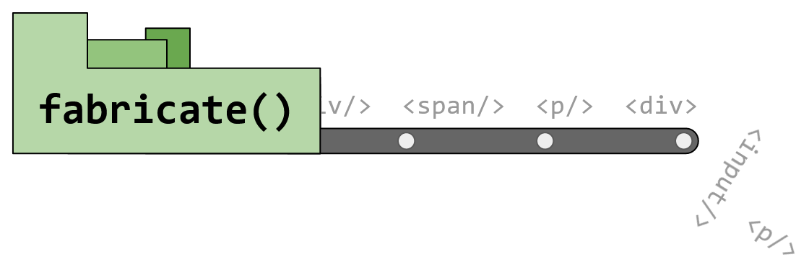

# fabricate

> n. To create quickly and easily.



A tiny vanilla JS webapp framework with a fluent API and zero dependencies,
intended for small apps with relatively simply layouts. Comes with some
pre-prepared components to get started quickly.

- [Introduction](#introduction)
- [Installation](#installation)
- [API](#api)
- [Run tests](#run-tests)

See `examples` for some simple example apps.


## Installation

Install from a CDN, such as `unpkg`:

```html
<!-- Where x.y.z is a published version -->
<script src="https://unpkg.com/fabricate.js@x.y.z/fabricate.js"></script>
```

or install from [npm](https://www.npmjs.com/package/fabricate.js) and copy or
reference `fabricate.js` from `node_modules`:

```html
<script type="text/javascript" src="./lib/fabricate.js"></script>
```


## Introduction

The aim of `fabricate` is to allow a quick and expressive way to set up UI
with a fluent API based on method chaining. This allows creating elements with
styles, attributes, handlers, and child elements in an easy and predictable
fashion.

For example, a text element in a padded container:

```js
const Text = (text) => fabricate('span')
  .setText(text)
  .withStyles({ fontSize: '1.1rem' });

const Container = () => fabricate('div')
  .asFlex('column')
  .withStyles({ padding: '10px' });

const ExamplePage = () => Container()
  .withChildren([
    Text('Hello, world!'),
    Text('Welcome to fabricate.js!'),
  ]);

// Use as the root app element
fabricate.app(ExamplePage());
```

Components can be extended after they are created, for example a button with
a hover-based effect:

```js
const BasicButton = () => fabricate('div')
  .asFlex('column')
  .withStyles({
    padding: '8px 10px',
    color: 'white',
    backgroundColor: 'black',
    borderRadius: '5px',
    justifyContent: 'center',
    cursor: 'pointer',
  })
  .onHover({
    start: el => el.addStyles({ filter: 'brightness(1.1)' }),
    end: el => el.addStyles({ filter: 'brightness(1)' }),
  });

const SubmitButton = () => BasicButton()
  .setText('Submit')
  .withStyles({ backgroundColor: 'green' })
  .onClick(() => alert('Success!'));

const CancelButton = () => BasicButton()
  .setText('Cancel')
  .withStyles({ backgroundColor: 'red' })
  .onClick(() => alert('Cancelled!'));
```

See the `examples` directory for more examples.

Some basic components are available to quickly build UI, see below for more
details.


## API

* [Create `Component`](#component)
  * [`.asFlex()`](#asflex)
  * [`.withStyles()` / `withAttributes()`](#withstyles--withattributes)
  * [`.withChildren()` / `addChildren()`](#withchildren--addchildren)
  * [`.onClick()` / `onHover()` / `onChange()`](#onclick--onhover--onchange)
  * [`.clear()`](#clear)
  * [`.then()`](#then)
* [`fabricate` / `fab` helpers](#fabricate--fab)
  * [`.isMobile()`](#ismobile)
  * [`.app()`](#app)
  * [`.updateState()` / `.watchState()`](#updatestate--watchstate)
  * [`.manageState()`](#managestate)
  * [`.when()`](#when)
  * [`.clearState()`](#clearstate)
* [Built-in Components](#built-in-components)
  * [`Row`](#row)
  * [`Column`](#column)
  * [`Text`](#text)
  * [`Image`](#image)
  * [`Button`](#button)
  * [`NavBar`](#navbar)
  * [`TextInput`](#textinput)
  * [`Loader`](#loader)
  * [`Card`](#card)
  * [`Fader`](#fader)
  * [`Pill`](#pill)


### `Component`

To create a `Component`, simply specify the tag name:

```js
const EmptyDivComponent = () => fabricate('div');
```

> The convenience alias `fab` is also available.

#### `.asFlex()`

To quickly set basic `display: flex` and `flexDirection`:

```js
const Column = () => fabricate('div').asFlex('column');
```

> The `Row` and `Column` basic components are included for this purpose.

#### `.withStyles()` / `withAttributes()`

Use more method chaining to flesh out the component:

```js
const BannerImage = (src) => fabricate('img')
  .withStyles({
    width: '800px',
    height: 'auto',
  })
  .withAttributes({ src });
```

> Semantic aliases `addStyles()` and `addAttributes()` are also available.

#### `.withChildren()` / `addChildren()`

Add other components as children to a parent:

```js
const ButtonRow = () => fab.Row()
  .withChildren([
    fab.Button({ text: 'Submit'}),
    fab.Button({ text: 'Cancel'}),
  ]);
```

> A semantic alias `addChildren` is also available.

#### `.onClick()` / `onHover()` / `.onChange()`

Add click and hover behaviors, which are provided the same element to allow
updating styles and attributes etc:

```js
fab.Button({ text: 'Click me!' })
  .onClick(el => alert('Clicked!'))
  .onHover({
    start: el => console.log('maybe clicked'),
    end: el => console.log('maybe not'),
  });
```

Hovering can also be implemented with just a callback if preferred:

```js
fab.Button({ text: 'Click me!' })
  .onClick(el => alert('Clicked!'))
  .onHover((el, hovering) => console.log(`hovering: ${hovering}`));
```

For inputs, the `change` even can also be used:

```js
fab.TextInput({ placeholder: 'Email address' })
  .onChange((el, value) => console.log(`Entered ${value}`));
```

#### `.setText()` / `.setHtml()`

For simple elements, set their `innerHTML` or `innerText`:

```js
fabricate('div')
  .withStyles({ backgroundColor: 'red' })
  .setText('I am a red <div>');
```

Or set HTML directly:

```js
fabricate('div')
  .setHtml('<span>I\'m just more HTML!</div>');
```

#### `.clear()`

For components such as lists that refresh data, use `clear()` to remove
all children:

```js
const UserList = ({ users }) => fabricate('div')
  .asFlex('column')
  .withChildren(users.map(User));

/**
 * When new data is available.
 */
const refreshUserList = (newUsers) => {
  userList.clear();
  userList.addChildren(newUsers.map(User));
};
```

#### `.then()`

Simple method to do something immediately after creating a component with
chain methods:

```js
fab.Text({ text: 'Example text' })
  .withStyles({ color: 'blue' })
  .then(() => console.log('Text was created'));
```


### `fabricate` / `fab`

The imported object also has some helper methods to use:

#### `.isMobile()`

```js
// Detect a very narrow device, or mobile device
fab.Text()
  .withStyles({ fontSize: fab.isMobile() ? '1rem' : '1.8rem' })
```

#### `.app()`

Use `app()` to start an app from the `document.body`. You can also specify an
initial state, as well as options.

```js
const page = PageContainer()
  .withChildren([
    fab.Title('My New App'),
    fab.NavBar(),
    MainContent()
      .withChildren([
        HeroImage(),
        Introduction(article.body),
      ]),
  ]);

const initialState = {
  article: {
    title: 'Using fabricate.js in web apps',
    description: 'Lorem ipsum...',
  },
};

const options = {
  logStateUpdates: true,
};

fabricate.app(page, initialState, options);
```

#### `.updateState()` / `.watchState()`

A few methods are available to make it easy to maintain some basic global state
and to update components when those states change. A list of keys to watch
can be provided, otherwise all state updates are notified.

> To receive the initial state update when using a key list, include
> `fabricate:init` in the list.

```js
// View can watch some state - specifically, 'state.counter'
const counterView = fab.Text()
  .watchState(
    (el, newState, key) => el.setText(newState.counter),
    ['fabricate:init', 'counter'],
  );

// Initialise first state
fabricate.app(counterView, { counter: 0 });

// Update the state using the previous state
setInterval(() => {
  fab.updateState('counter', prev => prev.counter + 1);
}, 1000);
```

#### `.manageState()`

Manage some component-local state, useful for state that is deep in a component
tree or is not used elsewhere in the app. Requires component class name/unique
name, state key, and an optional initial value.

```js
const ValueView = () => {
  const counterState = fabricate.manageState('ValueView', 'counter', 0);

  return fabricate.Button({ text: 'Click me' })
    .onClick(() => counterState.set(counterState.get() + 1))
    .watchState(
      (el, newState, key) => el.setText(`Counted: ${newState[counterState.key]})`),
    );
};
```

#### `.when()`

Conditionally add or remove a component (or tree of components) using the `when`
method:

```js
const pageContainer =  fab.Column()
  .withChildren([
    // Check some state, and provide a function to build the component to show
    fab.when(
      state => state.showText,
      () => fab.Text({ text: 'Now you see me!'}),
    ),
  ]);

// Use as the root app element and provide first state values
fabricate.app(pageContainer, { showText: false });

// Later, add the text
setInterval(
  () => fab.updateState('showText', state => !state.showText),
  2000,
);
```

See [`examples/login.html`](examples/login.html) for a more complex example of
conditional rendering in action.


#### `.clearState()`

Clear all state stored:

```js
fabricate.clearState();
```


### Built-in Components

#### `Row`

A simple flex row:

```js
fab.Row()
  .withChildren([
    fab.Button().setText('Confirm'),
    fab.Button().setText('Cancel'),
  ]);
```

#### `Column`

A simple flex column:

```js
fab.Column()
  .withChildren([
    fab.Image({ src: '/assets/images/gallery1.png' }),
    fab.Image({ src: '/assets/images/gallery2.png' }),
  ]);
```

#### `Text`

Basic text component:

```js
fab.Text({ text: 'Hello, world!' });
```

#### `Image`

Basic image component:

```js
fab.Image({
  src: '/assets/images/gallery01.png',
  width: 640,
  height: 480,
});
```

#### `Button`

A simple button component with optional hover highlight behavior:

```js
fab.Button({
  text: 'Click me!',
  color: 'white',
  backgroundColor: 'gold',
  highlight: true,
});
```

#### `NavBar`

NavBar component for app titles, etc. Can contain more components within itself:

```js
fab.NavBar({
  title: 'My Example App',
  color: 'white',
  backgroundColor: 'purple',
})
  .withChildren([
    fab.Button({ text: 'Home' })
      .onClick(goHome),
    fab.Button({ text: 'Gallery' })
      .onClick(goToGallery),
  ]);
```

#### `TextInput`

A basic text input box with padding:

```js
fab.TextInput({
  placeholder: 'Enter email address',
  color: '#444',
  backgroundColor: 'white'
})
  .onChange((el, newVal) => console.log(`Email now ${newVal}`));
```

#### `Loader`

Customizable CSS-based spinner/loader:

```js
fab.Loader({
  size: 48,
  lineWidth: 5,
  color: 'red',
});
```

#### `Card`

Simple Material-like card component for housing sections of other components:

```js
fab.Card()
  .withChildren([
    fab.Image({ src: '/assets/images/gallery01.png' }),
  ]);
```

#### `Fader`

Container that fades in upon creation to smoothly show other components inside:

```js
fab.Fader({
  durationS: 0.6,
  delayMs: 300,
});
```

#### `Pill`

Basic pill for category selection or tags etc:

```js
fab.Row()
  .withChildren([
    Pill({
      text: 'All',
      color: 'white',
      backgroundColor: 'green',
    }),
    Pill({
      text: 'Favorites',
      color: 'white',
      backgroundColor: 'red',
    }),
    Pill({
      text: 'Unread',
      color: 'white',
      backgroundColor: 'blue',
    }),
  ]);
```

## Run tests

### Unit tests

Run unit tests:

```
npm test
```
